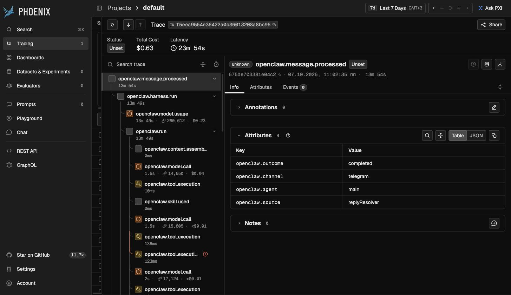
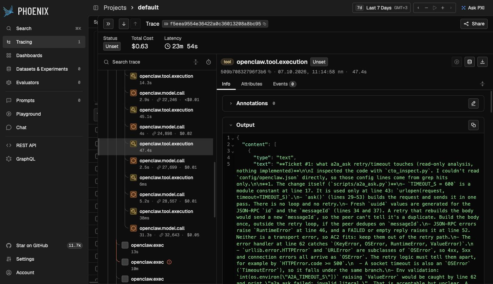
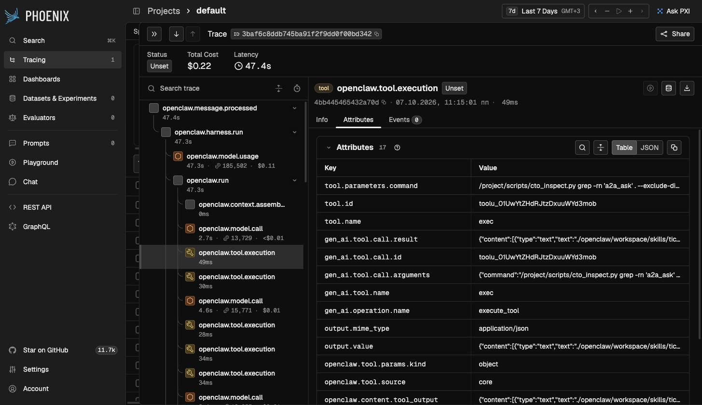
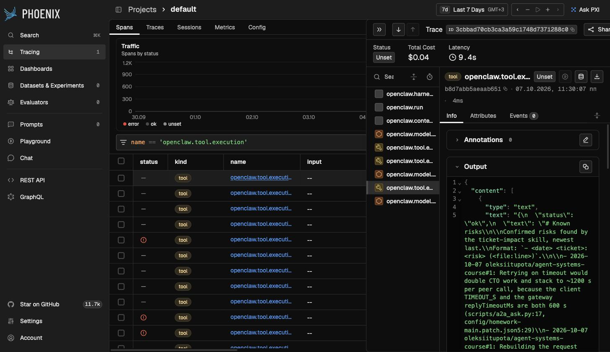

# Homework: ticket-impact agent team

Fwdays **Agent Systems** homework, built on top of the course starter in this
repository.

You send ticket ids to a Telegram bot. You get back one impact report per ticket:
what the change touches in the code, with `file:line` references, the risks, and
the open questions. Confirmed risks are saved to shared memory and reused in
later conversations.

```
Telegram ──► main (Chief of Staff, gateway A)
               │  scripts/a2a_ask.py  (A2A 1.0 JSON-RPC, bearer token)
               ├──► generalist (gateway A) ── GitHub MCP, read-only ──► issues
               └──► cto        (gateway B) ── cto_inspect.py ──► target/ (read-only repo)
             knowledge/risks.md  ◄── confirmed risks (persistent memory)
both gateways ── OTLP/HTTP ──► Phoenix (traces of model calls, tools, A2A)
```

## How each requirement is met

| Requirement | Implementation | Evidence |
| --- | --- | --- |
| 1. At least two agents with different roles, instructions and access limits; a model plus a tool or MCP server | `main` coordinates and may only run `a2a_ask.py`. `generalist` reads tickets through the GitHub MCP in read-only mode (`X-MCP-Readonly`), and no other agent gets MCP tools. `cto` runs on its own gateway and may only run `cto_inspect.py` inside `target/`. Model: `anthropic/claude-sonnet-5-5`. | `config/homework-*.patch.json5`, `openclaw/workspace/agents/cto/AGENTS.md` |
| 2. Persistent memory used after a restart in a new conversation | `ticket-impact` appends confirmed risks to `knowledge/risks.md`. Agents search it with `memory_search` / `memory_get` before they start work. | [`knowledge/risks.md`](openclaw/workspace/knowledge/risks.md); screenshot below: a fresh session after a restart answers from memory |
| 3. Communication channel | Telegram bot bound to `main`, DM pairing, groups disabled | `scripts/homework_setup.sh` |
| 4. Collaboration over A2A | Both teammates are A2A 1.0 peers with agent cards at `/.well-known/agent-card.json`. Each peer needs its own bearer token. `main` calls them synchronously with `scripts/a2a_ask.py`. | `curl localhost:18789/.well-known/agent-card.json`, `curl localhost:18791/.well-known/agent-card.json` |
| 5. Observability | The bundled `diagnostics-otel` plugin on both gateways exports to Arize Phoenix. Traces show model calls, tool calls with arguments and results, A2A calls, durations, cost and errors. | http://127.0.0.1:6006, screenshots below |

## Prerequisites

- Docker with Compose v2, `python3`, `openssl`
- **Anthropic API key** (`sk-ant-api…` from console.anthropic.com). A Claude Code subscription token does not work with OpenClaw.
- **Telegram bot token** from [@BotFather](https://t.me/BotFather)
- **GitHub fine-grained PAT** limited to the repository whose issues you analyse, with `Issues: Read` and `Contents: Read`
- A repository for CTO to analyse (`TARGET_REPO`). The demo uses this checkout itself.

Free host ports: `18789` (gateway A), `18791` (gateway B), `6006` (Phoenix).

## Setup

All commands run from the repository root.

```sh
# 1. Private settings: dashboard secrets, paths, and an empty .local/openclaw.env
python3 docker/init.py env
echo "TARGET_REPO='$PWD'" >> .env          # or any repository to analyse

# 2. Credentials, entered privately (this file is git-ignored)
cat >> .local/openclaw.env <<'EOF'
ANTHROPIC_API_KEY=sk-ant-api...
TELEGRAM_BOT_TOKEN=...
GITHUB_MCP_TOKEN=github_pat_...
EOF

# 3. A2A tokens for both peers, gateway B's own env file and dashboard token
./scripts/homework_setup.sh env

# 4. Images and fresh config volumes for both gateways
docker compose pull openclaw phoenix
docker compose run --rm --no-deps --user 0:0 openclaw     python3 /project/docker/init.py openclaw
docker compose run --rm --no-deps --user 0:0 openclaw-cto python3 /project/docker/init.py openclaw

# 5. Start
docker compose up -d openclaw openclaw-cto phoenix

# 6. One-time onboarding per gateway (interactive): keep the workspace
#    /project/openclaw/workspace, skip channels and host service installation.
docker compose exec openclaw     openclaw onboard --no-install-daemon --skip-bootstrap
docker compose exec openclaw-cto openclaw onboard --no-install-daemon --skip-bootstrap

# 7. Homework configuration: model, A2A, MCP, Telegram, exec allowlists, tracing
./scripts/homework_setup.sh

# 8. Smoke test: both A2A peers answer
docker compose exec openclaw /project/scripts/a2a_ask.py cto 'Reply with your agent id.'
docker compose exec openclaw /project/scripts/a2a_ask.py generalist 'Reply with your agent id.'
```

Pair Telegram. Send any message to your bot, then approve only your own request:

```sh
docker compose exec openclaw openclaw pairing list telegram
docker compose exec openclaw openclaw pairing approve telegram <CODE>
```

`homework_setup.sh` is safe to run again. Each step reports `No change` or
`Already allowlisted`.

## Demo scenario

1. Create two or three issues in the repository your PAT can read. This repo
   uses [#1–#3](https://github.com/oleksiitupota/agent-systems-course/issues).
2. In Telegram:
   ```
   Зроби impact для oleksiitupota/agent-systems-course#1, #2, #3
   ```
   `main` processes the tickets one by one. For each ticket, `generalist` reads
   the issue over A2A and MCP, then `cto` analyses `target/` over A2A. `main`
   merges both results into a report and appends the new risks to
   `knowledge/risks.md`. Three tickets take about 3–5 minutes.
3. Memory after a restart:
   ```sh
   docker compose restart openclaw openclaw-cto
   ```
   In Telegram, send `/new`, then `Які ризики ми вже знайшли по #2? Без скіла, тільки з пам'яті.`
   The answer cites `knowledge/risks.md`.
4. Open Phoenix at http://127.0.0.1:6006 → project `default`. The Telegram run
   has `openclaw.channel = telegram`. CTO and Generalist runs have
   `openclaw.channel = a2a`.

## Screenshots

Telegram run on gateway A: the channel, the agent, the skill, model calls and tool calls.



The A2A call from `main` to `cto`: the tool output is CTO's analysis with line references.



Gateway B: CTO inspects code only through `cto_inspect.py`.



Memory after a restart: a new session reads `knowledge/risks.md` with `memory_get`.



## Access limits

| Agent | Can | Cannot |
| --- | --- | --- |
| `main` | Telegram, memory, workspace files, run `/project/scripts/a2a_ask.py` | MCP tools, `sessions_spawn`, any other command (exec allowlist) |
| `generalist` | GitHub MCP in read-only mode, optional Jira MCP (its tool list holds only MCP tools) | Files, shell commands, delegation |
| `cto` | Run `/project/scripts/cto_inspect.py`: `grep`, `head`, `cat`, `wc`, `ls` and read-only `git` subcommands inside `target/` | Paths outside `target/`, `find`, `git -c`, `--no-index`, `--contents`, unverified revisions, delegation, MCP |

Gateway B (`openclaw-cto`) is isolated further:

- It receives only `ANTHROPIC_API_KEY` and `A2A_CTO_TOKEN` (from `.local/cto.env`).
- It has its own dashboard token.
- The project is mounted read-only, and only the CTO workspace is writable.
- Gateway A's `.local/` and `.env` are hidden inside the container.

`scripts/test_cto_inspect.py` checks 26 escape attempts. `scripts/test_a2a_ask.py`
checks the A2A client against a fake peer.

```sh
python3 scripts/test_cto_inspect.py && python3 scripts/test_a2a_ask.py
```

## Known limitations

- **Children started with `sessions_spawn` never get MCP tools**
  ([openclaw#85030](https://github.com/openclaw/openclaw/issues/85030)). That is
  why `main` reaches `generalist` over A2A instead of spawning it.
- **Unquoted globs need a human approval.** An unquoted `*` or a shell operator
  in an exec command needs an approval that never arrives over A2A, so the call
  times out after 600 s. `cto` is instructed to single-quote patterns. To
  unblock a stuck call, run `docker compose exec openclaw-cto openclaw approvals pending`,
  then `… approvals resolve <id> allow-once`.
- **One message per ticket is not guaranteed.** The skill asks for a separate
  message for each ticket, but the model sometimes merges the reports into one
  reply.
- **`config/openclaw-policy.patch.json` from the course starter fails validation**
  on OpenClaw 2026.9.8, because it uses `mode` together with `security`/`ask`.
  The policy the starter intends is already in place after
  `docker/init.py openclaw`.
- **A restart can be slow.** After `--force-recreate`, a gateway can wait about
  2–3 minutes for the previous state lease to expire before it listens again.
